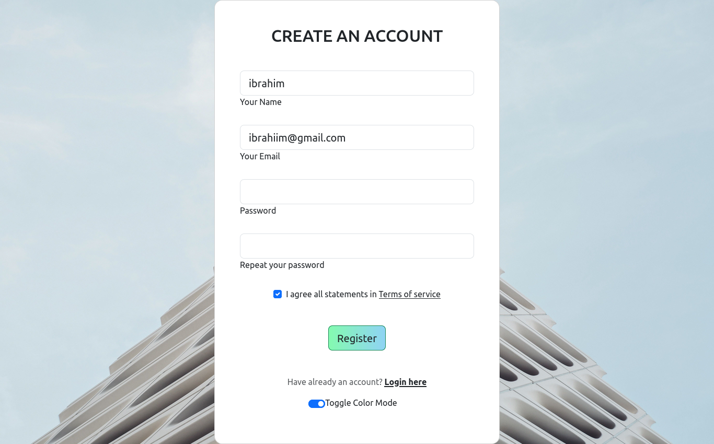

# Bootstrap Form

This repository contains a form built with Bootstrap, a popular CSS framework. The form is designed to be responsive and visually appealing, providing a user-friendly experience for collecting user input.

You can Access the Form in this link

```ibrahimfe.github.io/Form_With_Bootstrap```

## Features

- Responsive design that adapts to various screen sizes.
- Utilizes Bootstrap components and styles for consistent and modern form elements.
- Valid HTML5 markup for accessibility and compatibility.
- Easy to customize and integrate into existing projects.

## Preview




## Usage

1. Clone the repository or download the source code.
2. Include the necessary Bootstrap CSS and JS files in your HTML file.
3. Copy the HTML markup of the form from `index.html` and paste it into your project where you want to display the form.
4. Customize the form as per your requirements by modifying the HTML, CSS, or adding additional fields.

## Dependencies

- Bootstrap (version 5.3.0): [Bootstrap](https://getbootstrap.com/)

## Contributing

Contributions are welcome! If you find any issues or have suggestions for improvements, please feel free to open an issue or submit a pull request.

## License

The code in this repository is licensed under the [MIT License](LICENSE).

## Acknowledgements

- [Bootstrap](https://getbootstrap.com/)
- [Wallpaperaccess](https://wallpaperaccess.com/)

